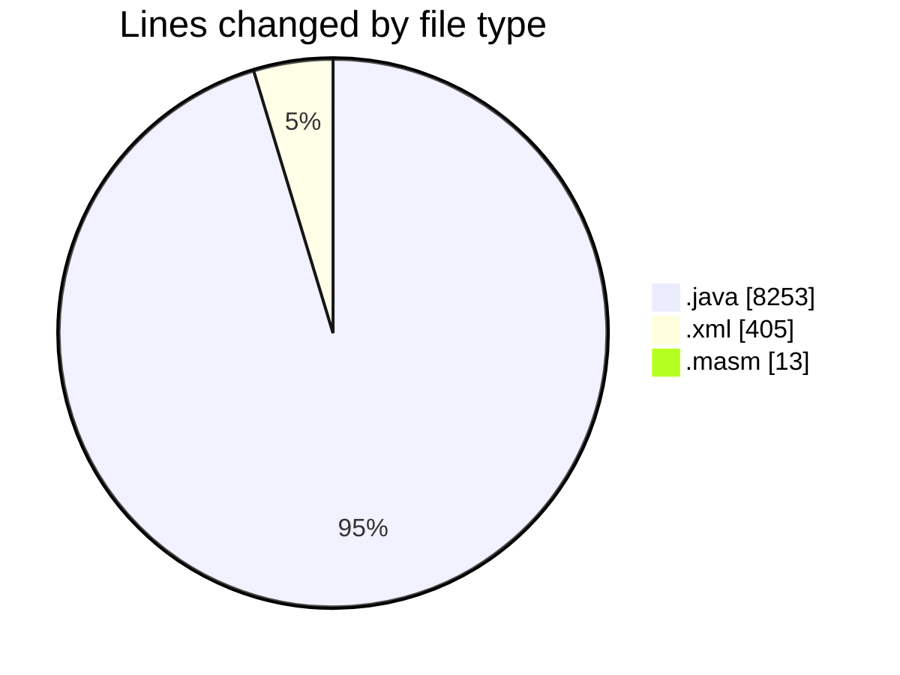
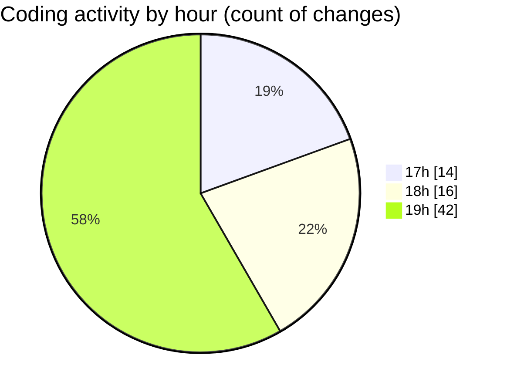

# jmasm - Activity Summary 

## Overall Statistics

| Stat                   | Value                                                             |
| ---------------------- | ----------------------------------------------------------------- |
| **Lines Added** (➕)   | 7250                                          |
| **Lines Removed** (➖) | 1421                                        |
| **Net Change** (↕)    | 5829                |
| **Active Time** (⌚)   | 81 minutes |

## Modified Files
- **ArgumentParserTest.java** (+77, -0)
- **pom.xml** (+375, -12)
- **InterpTest.java** (+138, -1)
- **interp.java** (+1790, -594)
- **FunctionsTest.java** (+484, -1)
- **ModuleInit.java** (+278, -0)
- **Main.java** (+269, -91)
- **MNIMethodObject.java** (+195, -0)
- **Functions.java** (+2467, -312)
- **common.java** (+801, -407)
- **IO.java** (+37, -0)
- **TODOS.java** (+56, -0)
- **PythonIntergrations.java** (+37, -0)
- **debug.java** (+218, -0)
- **misc.xml** (+18, -0)
- **main.masm** (+10, -3)

## Visualizations

### By File Type (Lines Changed)

### By Hour (Estimated Activity Count)

> **Last Updated:** 01/05/2025, 19:53:28