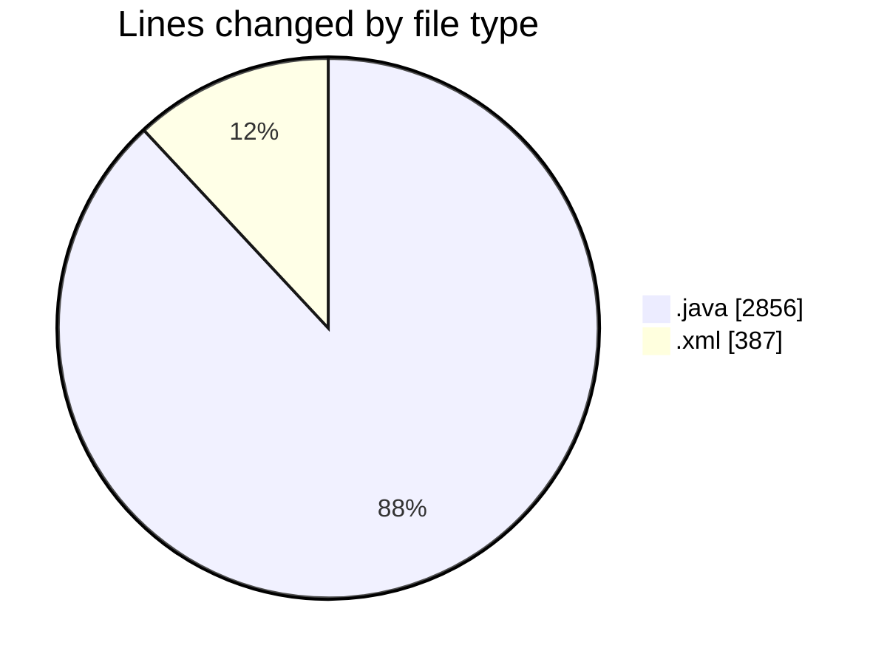
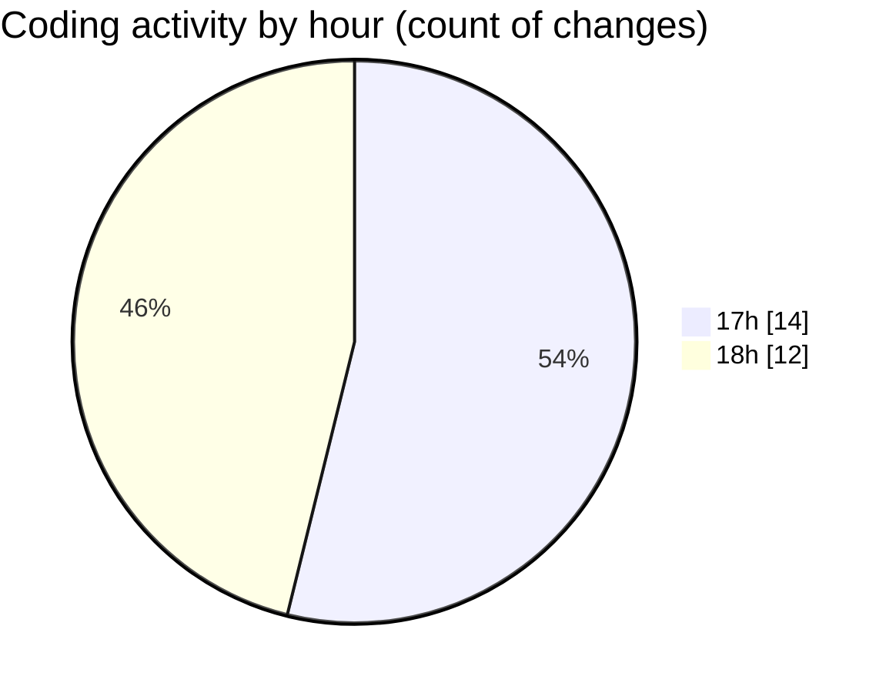

# jmasm - Activity Summary 

## Overall Statistics

| Stat                   | Value                                                             |
| ---------------------- | ----------------------------------------------------------------- |
| **Lines Added** (➕)   | 3209                                          |
| **Lines Removed** (➖) | 34                                        |
| **Net Change** (↕)    | 3175                |
| **Active Time** (⌚)   | 23 minutes |

## Modified Files
- **ArgumentParserTest.java** (+77, -0)
- **pom.xml** (+375, -12)
- **InterpTest.java** (+138, -1)
- **interp.java** (+592, -0)
- **FunctionsTest.java** (+484, -1)
- **ModuleInit.java** (+139, -0)
- **Main.java** (+89, -0)
- **MNIMethodObject.java** (+195, -0)
- **Functions.java** (+1120, -20)

## Visualizations

### By File Type (Lines Changed)

### By Hour (Estimated Activity Count)

> **Last Updated:** 01/05/2025, 18:24:20