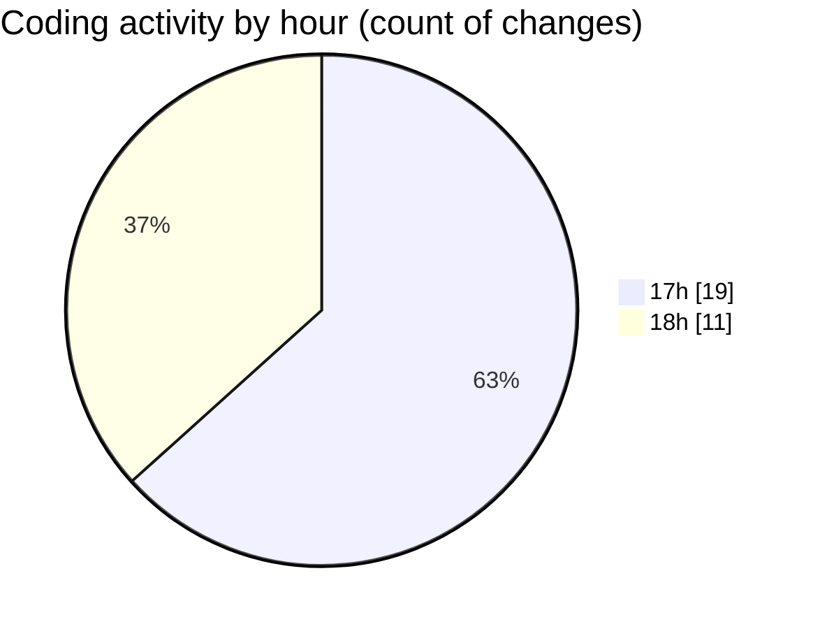

# uhigh-lang - Activity Summary 

## Overall Statistics

| Stat                   | Value                                                             |
| ---------------------- | ----------------------------------------------------------------- |
| **Lines Added** (➕)   | 941                                          |
| **Lines Removed** (➖) | 142                                        |
| **Net Change** (↕)    | 799                |
| **Active Time** (⌚)   | 43 minutes |

## Modified Files
- **uhigh.py** (+588, -95)
- **main.masm** (+257, -41)
- **main.uh** (+96, -6)

## Visualizations

### By File Type (Lines Changed)

### By Hour (Estimated Activity Count)

> **Last Updated:** 01/05/2025, 18:06:00