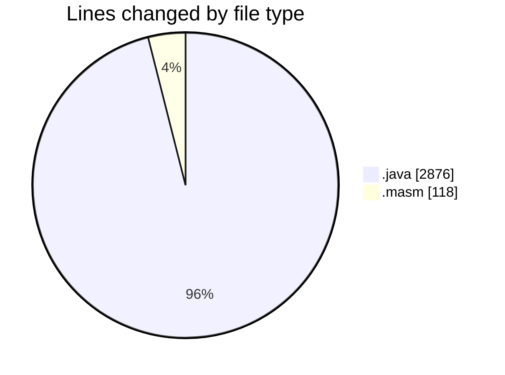
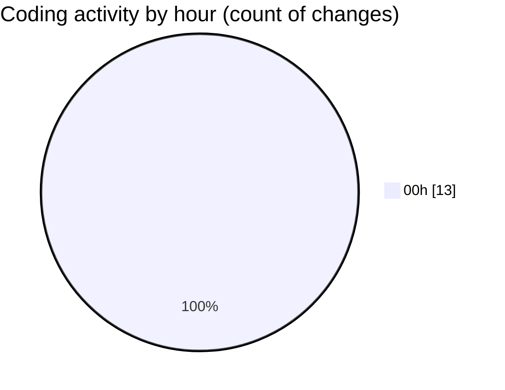

# jmasm - Activity Summary 

## Overall Statistics

| Stat                   | Value                                                             |
| ---------------------- | ----------------------------------------------------------------- |
| **Lines Added** (➕)   | 2807                                          |
| **Lines Removed** (➖) | 187                                        |
| **Net Change** (↕)    | 2620                |
| **Active Time** (⌚)   | 21 minutes |

## Modified Files
- **Functions.java** (+1289, -187)
- **TODOS.java** (+56, -0)
- **interp.java** (+604, -0)
- **cowsay.masm** (+118, -0)
- **Main.java** (+89, -0)
- **PythonIntergrations.java** (+37, -0)
- **common.java** (+396, -0)
- **debug.java** (+218, -0)

## Visualizations

### By File Type (Lines Changed)

### By Hour (Estimated Activity Count)

> **Last Updated:** 02/05/2025, 00:04:51