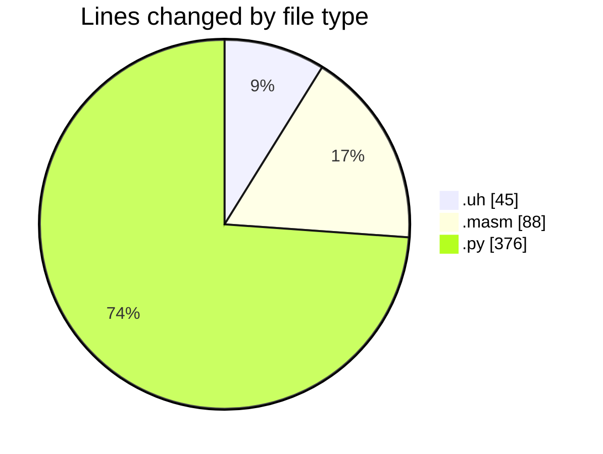
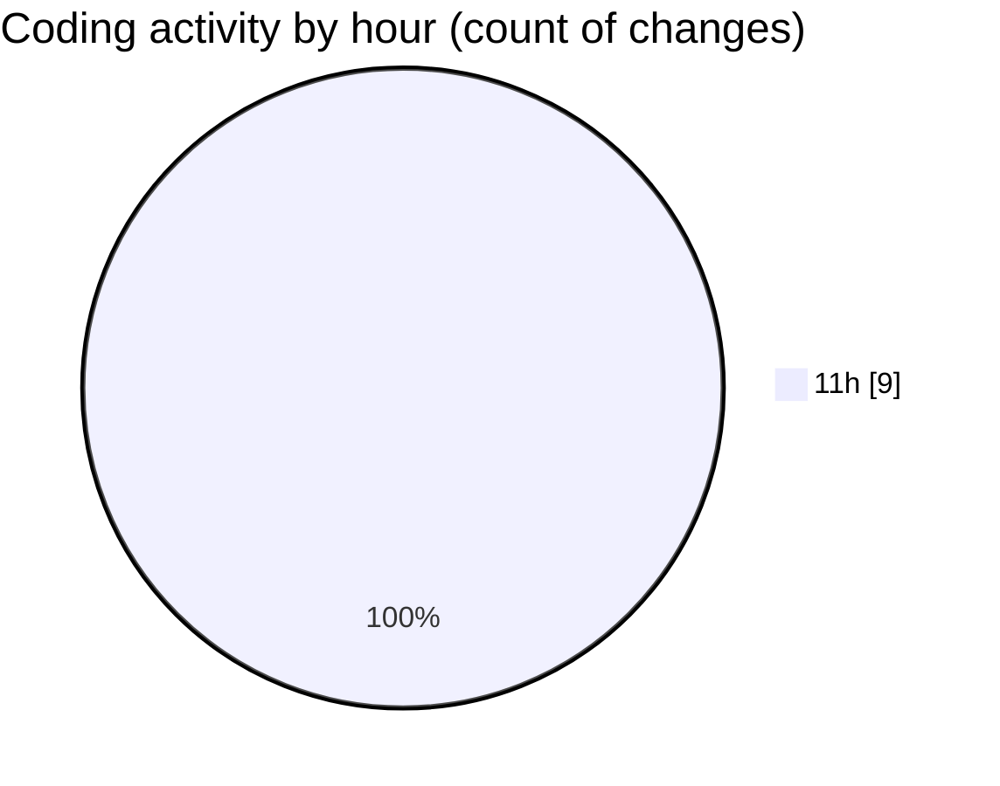

# uhigh-lang - Activity Summary 

## Overall Statistics

| Stat                   | Value                                                             |
| ---------------------- | ----------------------------------------------------------------- |
| **Lines Added** (➕)   | 459                                          |
| **Lines Removed** (➖) | 50                                        |
| **Net Change** (↕)    | 409                |
| **Active Time** (⌚)   | 14 minutes |

## Modified Files
- **main.uh** (+27, -18)
- **main.masm** (+56, -32)
- **uhigh.py** (+376, -0)

## Visualizations

### By File Type (Lines Changed)

### By Hour (Estimated Activity Count)

> **Last Updated:** 02/05/2025, 11:30:41