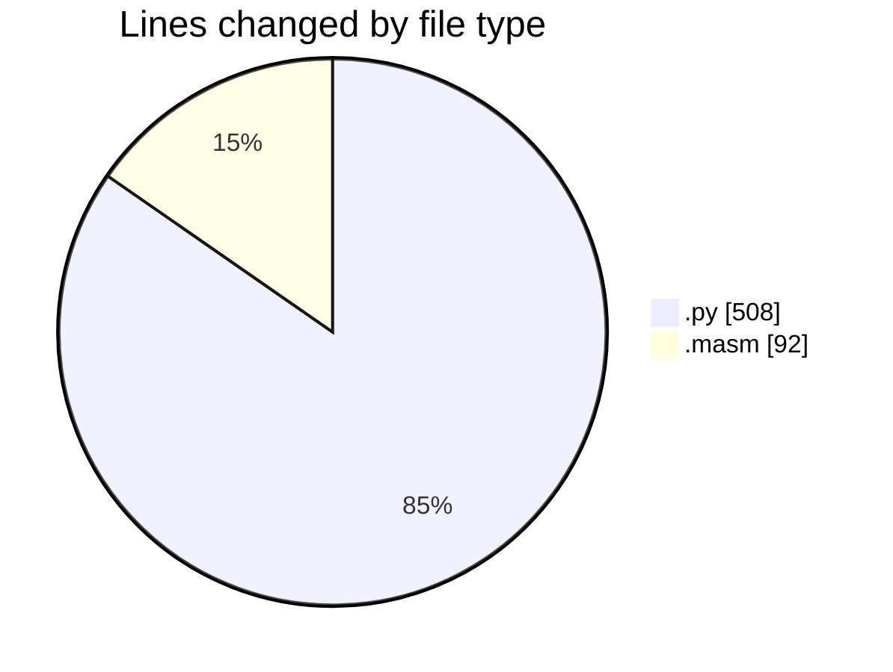
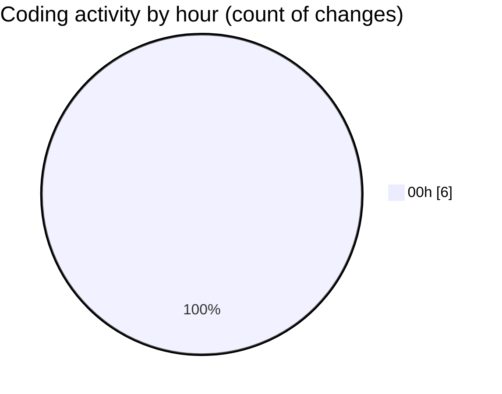

# uhigh-lang - Activity Summary 

## Overall Statistics

| Stat                   | Value                                                             |
| ---------------------- | ----------------------------------------------------------------- |
| **Lines Added** (➕)   | 598                                          |
| **Lines Removed** (➖) | 2                                        |
| **Net Change** (↕)    | 596                |
| **Active Time** (⌚)   | 6 minutes |

## Modified Files
- **uhigh.py** (+506, -2)
- **main.masm** (+92, -0)

## Visualizations

### By File Type (Lines Changed)

### By Hour (Estimated Activity Count)

> **Last Updated:** 5/6/2025, 12:54:46 AM